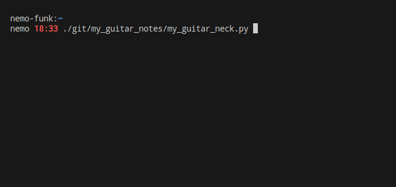

# my_guitar_neck

## Python version (currently dirty)

### What the hell is this ?

It's a dirty python program to guess the name of the notes on a guitar neck!



### Launching

```bash
$ ./my_guitar_neck.py
```

OR

```bash
$ python my_guitar_neck.py
```

